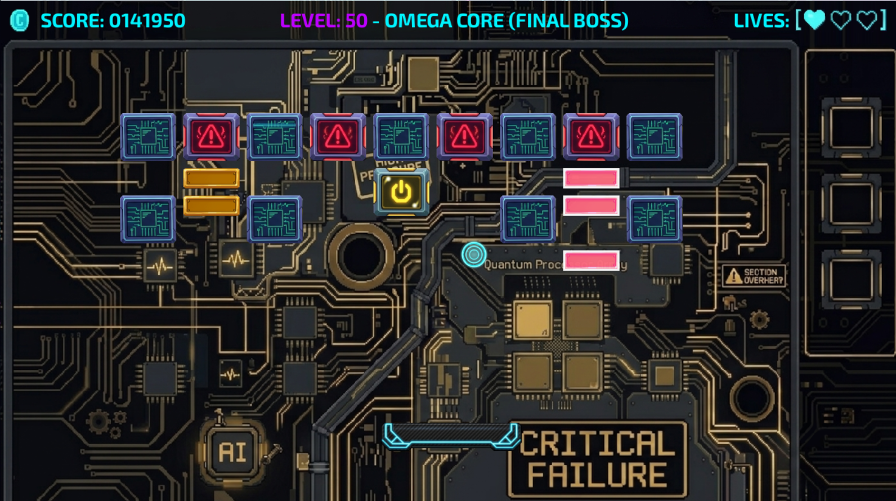
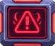
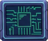
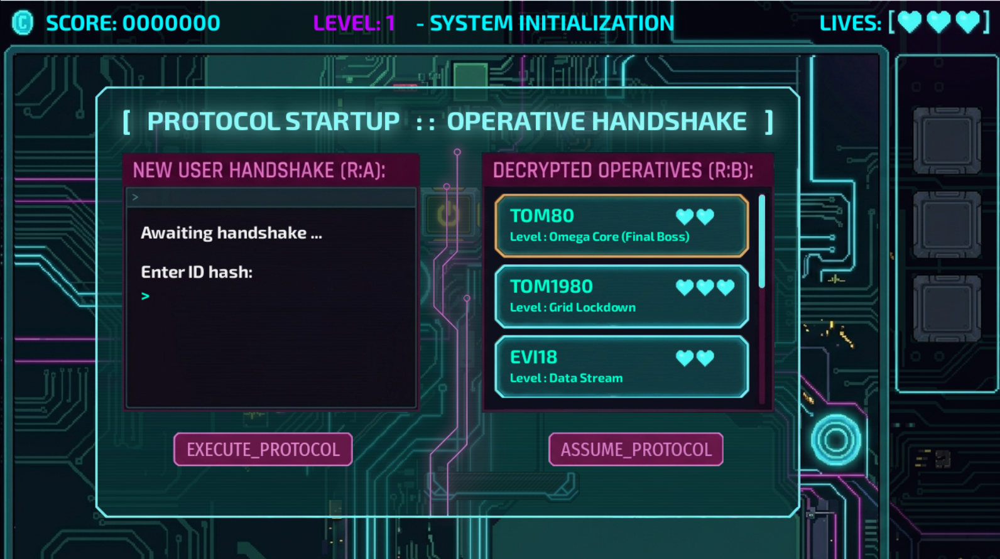
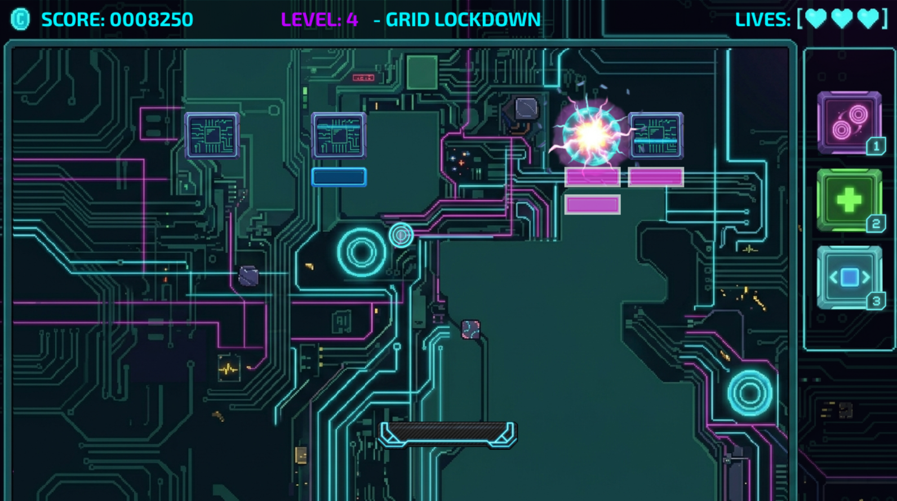
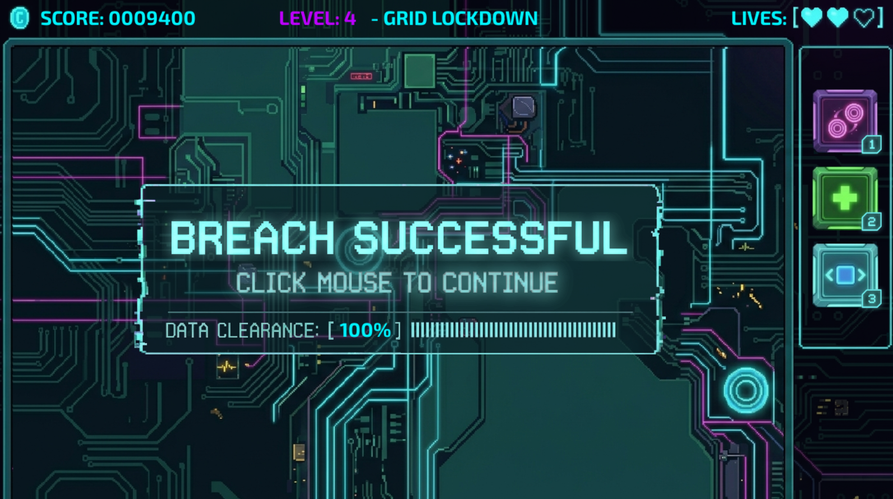

# System Breach Protocol ⚡
A High-Fidelity Cyberpunk Security Simulation Engine Built with Pygame

[](https://github.com/tomDeller80/system-breach-protocol/releases)
[](https://github.com/tomDeller80/system-breach-protocol/releases)


---

## 📥 Quick Download
**Download the latest standalone executable from the [Releases Page](https://github.com/tomDeller80/system-breach-protocol/releases).**  
>*No Python or Pygame installation required. Just download, unpack, and breach.*

**System Breach Protocol** is an intense, real-time security terminal simulation built entirely on the **Pygame** framework. Inspired by tactical sci-fi network intrusions, players take on the role of an elite operative manipulating packet pathways, syncing memory buffer arrays, and fracturing multi-layered hardened firewalls before the host system triggers a permanent terminal lockout.

---

## 📸 Preview

<p align="center">
  
  <br>
  <i>The core infiltration interface: Real-time payload sprite tracking and active layer degradation feedback.</i>
</p>

---

## 🖥️ System Requirements
* **Operating System:** Windows 10/11 (Cross-platform compatible via Python source execution).

* **Display Resolution:** 1280 x 720.

* **Dependencies:** Native hardware acceleration support for 2D surface rendering via Pygame.

---

## 🛠️ Key Functionality

### 1. Sprite Sheet State Engine
The app leverages Pygame's surface blitting system to animate shifting security nodes dynamically:
* **The Payload Vector (`ball.py`):** Drives a 10-frame sprite loop (`ball_f1.png` to `ball_f10.png`) that calculates bounce-vectors and collision boxes against target blocks.
* **The Stack Manipulation System (`buffer.py`):** Visualizes localized data storage blocks, managing data processing (`_p.png`) and register synchronization (`_s.png`).
* **The Layered Defense Matrix (`hardened.py`):** Draws a cascading 15-frame animation grid representing active firewall shielding parameters.

---

### 2. Real-Time Physics & Collision Processing
The internal mechanics compute immediate geometric responses:
* **Bounding-Box Tracking:** Utilizes Pygame standard Rect objects (`pygame.Rect`) to map interactions between payload projectiles and defensive block surfaces.
* **Velocity Buffering:** Accelerates frame changes and projectile motion rates as the host trace sequence closes in.

---

## 🎮 Operational Manual: How to Play

### 1. Core Objective
Your goal is to safely steer the active payload data packet (the **Ball**) through the defense matrix to break the outer firewall sectors (**Hardened Shields**) while keeping your memory storage (**Buffers**) optimized. 

### 2. The Blocks
<ul>
<li>&nbsp;&nbsp;<b>Basic Blocks:</b> The foundational firewall nodes. These require standard payload impacts to clear from the grid network.</li>
<br>
<li>
    &nbsp;&nbsp;High-value targets that randomly deploy 1 of 4 operational upgrade chips upon destruction:
    <br><br>
    ⚠️ <b>Inventory Mechanics:</b> Operatives can collect and store up to a maximum of 3 power-ups at any given time. These upgrade chips stack directly onto your active terminal HUD grid. Once collected; they must be manually deployed by pressing the corresponding <b>1</b>, <b>2</b>, or <b>3</b> keys on your keyboard.
    <br><br>
    <ul>
      <li>&nbsp;&nbsp;<b>Health Chip:</b> Restores structural integrity to your terminal connection before a hard lockout triggers.</li>
      <br>
      <li>&nbsp;&nbsp;<b>Speed Ball Chip:</b> Accelerates the payload vector, increasing kinetic damage variables at the cost of processing reaction times.</li>
      <br>
      <li>&nbsp;&nbsp;<b>Double Ball Chip:</b> Duplicates your active payload stream, releasing an additional data packet vector into the grid layout.</li>
      <br>
      <li>&nbsp;&nbsp;<b>Buffer Chip:</b> Expands the active paddle footprint, widening the memory buffer area to make packet catching significantly easier.</li>
    </ul>
</li>
<br>
<li>&nbsp;&nbsp; <b>Volatile Blocks:</b> Unstable memory sectors. Detonating these causes localized chain reactions but risks destabilizing your connection if mishandled.</li>
<br>
<li> &nbsp;&nbsp;<b>Hardened Blocks:</b> Direct collisions slowly erode these frames layer by layer. Upon shattering, they trigger a 1-second system glitch effect and cause a volatile-style explosion that takes down all neighboring Basic Blocks.</li>

</ul>

### 3. Interactive Pausing and Exiting
The terminal relies on Pygame's event processing loop (`pygame.event.get()`) to manage live system commands cleanly:

* **Pausing the Simulation:** Press the **`P` key** at any moment during game execution. This temporarily flags the game state updater to bypass position modifiers and animation frame advancement routines, locking the interface screen safely in place.
* **Exiting the System:** Press the **`Q` key**. The game intercepts this through `pygame.QUIT` protocols, cleanly flushing active surface structures from GPU memory before executing a clean `sys.exit()`.

---

## 📖 Usage Guide

### 1: Terminal Identity Authentication
Launch the application terminal to initialize the mainframe connection sequence. From this interface, you can register a new operational profile to begin tracking fresh session data, or select an existing authenticated user from the database registry to resume your breach history.



### 2. Executing the Intrusions
* Use your controls to interact with the environment blocks.
* Watch the color shifts: Red warnings reveal when a buffer register is about to overflow.
* Keep the payload moving cleanly inside the window dimensions to prevent data packet drops.

> 💡 **OPERATOR NOTE:** If you have collected power-up chips in your inventory slots, pausing the simulation will also freeze your inventory interaction. Ensure you trigger your **1**, **2**, or **3** deploy keys *before* pausing if you intend to execute those upgrades immediately upon unpausing the payload grid.

* 

### 3. Connection Diagnostics
Once the defense grid falls or the terminal lockout timer runs out, the engine displays an analytics screen breaking down total blocks smashed, simulation runtime, and operational efficiency ratings.



---

## 🚀 Getting Started

### 1. Clone the repository:
```bash
git clone https://github.com/tomDeller80/system-breach-protocol.git
cd "System Breach Protocol"
```

### 2. Install dependencies:
```bash
pip install -r requirements.txt
```

### 3. Run the app:
```bash
python main.py
```     
     
## 📦 Dependencies

**pygame:** The foundational multimedia engine powering sprite configurations, audio streams, window states, and double-buffered canvas painting routines.

## 🔒 Privacy & Operational Security

**Zero Host Telemetry:** The environment runs purely locally, recording no network usage or processing history metrics.

**No Cache Leaks:**  Temporary tracking values live strictly inside volatile runtime RAM and clear out entirely when the session ends.

## 🛠️ Development & Contribution

If you wish to contribute to System Breach: Protocol or customize the logic for your own use, follow the guide below to set up your local environment.

### 🏗️ Architecture Overview


The system follows a strict state-driven decoupling pattern to separate core vector mathematics and projectile mechanics from the primary Pygame graphics pipeline, user interface components, and asset handlers, fully optimized for standalone PyInstaller deployment:

* **`/assets`**: Houses the visual frame sheets, texturing states, audio components, and repository preview layouts (`/screenshots`). At runtime, these are dynamically resolved using a `sys._MEIPASS` path extraction helper to support both local development and compiled executable states.
* **`/core`**: Serves as the data backbone and high-level structural engine of the application, keeping operational mechanics isolated from surface rendering:
  * `physics_engine.py`: Orchestrates runtime entity collisions, movement validation, and boundary calculations.
  * `storage.py`: Manages file serialization, game saving/loading states, and persistent data manipulation.
  * `__init__.py`: Initializes the core subdirectory as an importable Python package.
* **`/utils`**: Contains global, low-level mathematical and systemic utilities decoupled from Pygame's engine loop:
  * `maths.py`: Provides pure mathematical formulas, matrix utilities, and raw geometric helper functions.
  * `physics.py`: Contains basic vector equations, acceleration curves, and raw kinematic constants.
  * `paths.py`: Houses global path resolution functions—including the `resource_path` wrapper—guaranteeing resource mapping stability across multi-platform bundles.
* **Root Level Execution & State Management (`.py`)**: 
  * `main.py`: Acts as the absolute entry point, setting up the resource path virtualization logic and handing execution over to the main loops.
  * `systembreach.py`: Drives the primary game state manager, structural clock loop, and Pygame event routers.
  * `sections.py`: Orchestrates scene transitions, core gameplay states, and high-level menu screens.
* **Entities & Game Mechanics (`.py`)**:
  * `players.py`: Manages the local user's entity definition, input translation, physics variables, and boundary handling.
  * `sprites.py`: Processes localized entity state changes, enemy AI routines, glitch timing, and payload boundary math independently before blitting.
  * `levels.py`: Governs wave generation thresholds, difficulty scaling metrics, and progression states.
* **User Interface & Feedback (`.py`)**:
  * `interface.py` & `popups.py`: Handle HUD rendering, modular UI frames, interactive layout rendering, and real-time contextual terminal popups.
  * `buttons.py`: Manages localized bounding boxes, state checking (hover/click), and callback mapping for UI elements.
  * `scoreboard.py`: Handles session performance analytics, local persistent scoring data, and rank formatting.
  * `mixer.py`: Isolates the Pygame audio channel distribution, volume scaling, and background ambiance tracks.
* **Storage, Tooling & Build References**: 
  * `System Breach Protocol.spec` & `main.spec`: Compilation manifests that explicitly flag the `/assets` directory for binary inclusion and specify build parameters (e.g., `--noconsole`).
  * `requirements.txt`: Target build dependencies list.
  * `pytest.ini` & `/tests`: Configuration and scripts for automated routine testing.
---

### 🧪 Running Tests
We use pytest to ensure the accuracy of speed calculations and data integrity. To run the test suite:

Install test dependencies:
```bash
pip install pytest 
```
Execute tests:
```bash
python -m pytest
```
> **Note:** The test engine hooks into the configurations defined in pytest.ini and discovers test cases structured inside the /tests directory, verifying core mathematical algorithms (/utils/maths.py) and collision math (/core/physics_engine.py) independently of the Pygame window initialization.
---

### 🔨 Building the Standalone Executable

If you want to compile the standalone executable manually using the pre-configured build manifests, run PyInstaller directly against the project spec file:

```bash
# Execute the build using your pre-configured settings
pyinstaller "System Breach Protocol.spec" --clean
```

**Alternative:** Building directly via CLI (No Spec File)
If you prefer to build a fresh executable directly from the command line without using the spec files, make sure to use the correct path separator for your operating system:

**Windows (PowerShell / CMD):**
```bash
pyinstaller --noconfirm --onefile --windowed --name="SystemBreachProtocol" --add-data "assets;assets" --icon="assets\icon.ico" main.py --clean
```

**Linux / macOS (Terminal):**
```bash
pyinstaller --noconfirm --onefile --windowed --name="SystemBreachProtocol" --add-data "assets:assets" --icon="assets/icon.ico" main.py --clean
```
### Why adding `--clean` matters
Adding the `--clean` flag is highly recommended for PyInstaller documentation. It forces the builder to clear its cache before compiling, which prevents ghost bugs or stale assets from a previous build from leaking into your new executable!

## 📝 License
This simulator is open-source and available under the MIT License.

Project Status: Active Maintenance.
